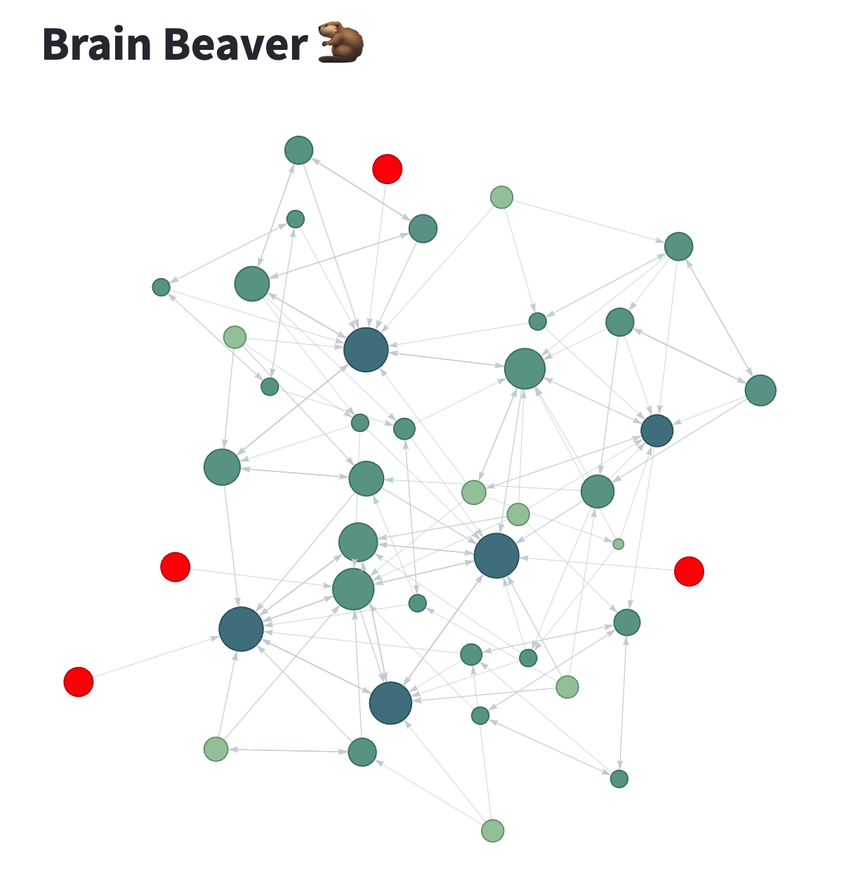

# Brain Beaver :beaver:

[:bulb: Streamlit | DEMO](https://brainbeaver-ln633jukejyg3sladcvgha.streamlit.app/)  



M1 맥북에어 기준으로 로컬에서 구동하는 방법을 설명드립니다.  
이런 모습의 지식그래프를 만들 수 있습니다.  

docker 폴더로 진입해서 db와 dbadmin을 구동합니다.
```shell
docker compose up
```

필요한 의존성을 설치하고 main.py에서 아래와 같이 루트경로, 샘플링, 테스트 개수를 조정합니다.
```python
# 마크다운 파일이 위치한 루트경로를 입력합니다.
root_dir = '/Users/bachtaeyeong/20_DocHub/TIL'

# 파일을 버킷 사이즈만큼 랜덤하게 샘플링합니다
file_list = sample_file_list(file_list=file_list, bucket_size=10)

# 파일을 정해진 테스트건수만큼만 처리합니다.
keyconcept_list = split_file_into_keyconcept(file_list=file_list[:10])
```

python 폴더로 이동해서 app.py 파일을 실행합니다.  
표준출력은 로그파일에 저장하고, tqdm 프로그레스바만 표시합니다.  
wandb를 적용해둬서 app.py만 실행해도 되긴합니다.  
```shell
python app.py > logs/$(date +%Y-%m-%d_%H:%M:%S).log
```

동일하게 python 폴더에서 streamlit을 실행합니다.
```shell
streamlit run view.py
```
